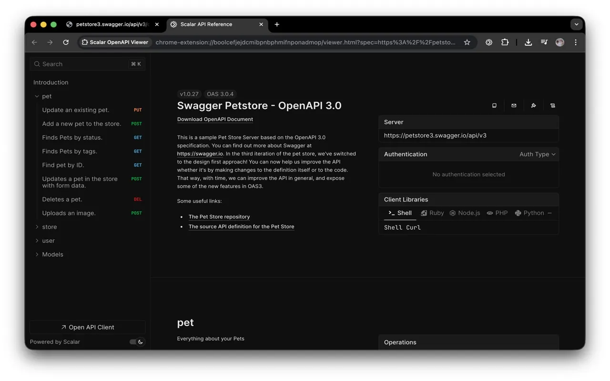
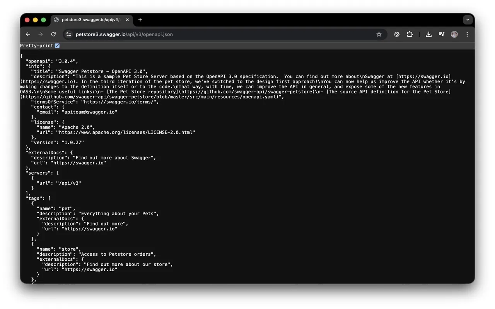
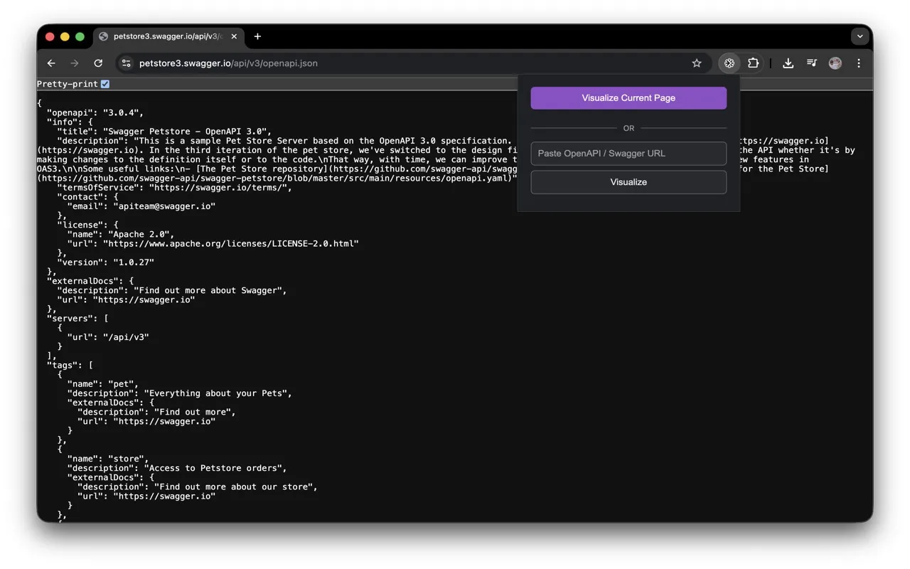

# Scalar OpenAPI Viewer

Transform raw OpenAPI/Swagger files into beautiful, interactive documentation in one click with the Scalar OpenAPI Viewer [Google Chrome extension](https://chromewebstore.google.com/detail/enljnjkaijiflghcdkhgoimoeecifbdh).

## Why use this extension?

Developers and testers often encounter raw OpenAPI (Swagger) files that look like this:

Reading this is painful. **Scalar OpenAPI Viewer** instantly renders it into a modern, navigable, and interactive documentation site directly in your browser.

## Features

*   ✨ **Instant Visualization:** Turn `.json` or `.yaml` URLs into a full API reference.
*   🌗 **Dark & Light Mode:** Automatically matches your system theme.
*   🔒 **Privacy First:** Runs in a secure sandbox. Your API specs are never sent to our servers.
*   ⚡ **Smart Detection:** Automatically detects if you are viewing an OpenAPI file and lets you visualize it with one click.

## How to use

### Option 1: Visualize Current Page (Recommended)
1.  Navigate to any URL ending in `.json`, `.yaml`, or `.yml` (e.g., a raw GitHub file or an API endpoint).
2.  Click the extension icon in your toolbar.
3.  Click **"Visualize Current Page"**.

### Option 2: Paste URL manually
1.  Click the extension icon.
2.  Paste any public OpenAPI URL into the input field.
3.  Click **"Visualize"**.

## Installation

[Download from Chrome Web Store](https://chrome.google.com/webstore/detail/enljnjkaijiflghcdkhgoimoeecifbdh) _(Review pending)_

## Manual Installation (Developer Mode)

1.  Clone this repository.
2.  Open Chrome and go to `chrome://extensions/`.
3.  Enable **"Developer mode"** in the top right.
4.  Click **"Load unpacked"**.
5.  Select the folder where you cloned this repository.

---

_Powered by [Scalar](https://scalar.com) - The modern API platform._